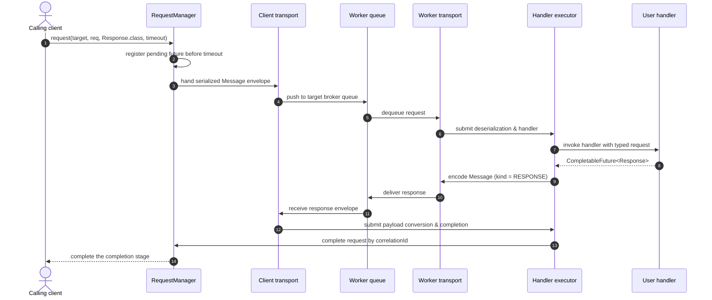
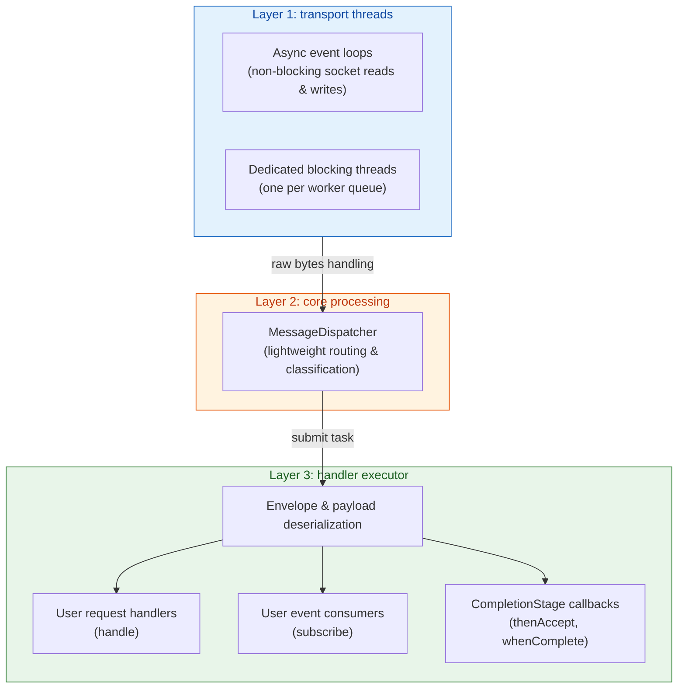

# Vyra architecture

Vyra is an asynchronous, type-safe messaging framework for Java. The whole design rests on one principle: **dumb transport, smart core**. A transport moves serialized bytes between nodes and knows nothing about routing; the core owns every routing, correlation, timeout, and conversion decision.

---

## 1. Module structure

Vyra is split into decoupled modules with clear ownership and no unnecessary dependencies:

| Module | Responsibility | Dependencies |
|---|---|---|
| [`vyra-core`](vyra-core) | Core message bus, routing, correlation, timeouts, handler dispatch, and public abstractions ([`Vyra`](vyra-core/src/main/java/org/vyra/core/Vyra.java), [`Transport`](vyra-core/src/main/java/org/vyra/core/Transport.java), [`Message`](vyra-core/src/main/java/org/vyra/core/Message.java), [`Serializer`](vyra-core/src/main/java/org/vyra/core/Serializer.java)). | None (pure Java 17) |
| [`vyra-redis`](vyra-redis) | Redis transport implementation using Lettuce, providing distributed worker queues and Pub/Sub routing ([`RedisVyra`](vyra-redis/src/main/java/org/vyra/redis/RedisVyra.java)). | Lettuce Redis driver |
| [`vyra-inmemory`](vyra-inmemory) | High-speed, dependency-free in-memory transport for local development, integration tests, and mock setups ([`InMemoryVyra`](vyra-inmemory/src/main/java/org/vyra/inmemory/InMemoryVyra.java)). | None |
| [`vyra-jackson`](vyra-jackson) | Reference serializer supporting human-readable JSON, compact Smile binary, and standard CBOR ([`JacksonSerializer`](vyra-jackson/src/main/java/org/vyra/jackson/JacksonSerializer.java)). | Jackson databind |
| [`vyra-gson`](vyra-gson) | Lightweight JSON serializer backed by Google Gson ([`GsonSerializer`](vyra-gson/src/main/java/org/vyra/gson/GsonSerializer.java)). | Google Gson |
| `examples` | End-to-end sample applications demonstrating common messaging patterns and cluster topologies. | Framework modules |

`vyra-core` has zero third-party dependencies. Everything else plugs into it.

---

## 2. Public API

The public surface is deliberately small: [`Vyra`](vyra-core/src/main/java/org/vyra/core/Vyra.java) (8 methods), [`VyraBuilder`](vyra-core/src/main/java/org/vyra/core/VyraBuilder.java) (5 options), the transport factory entry points, and supporting types ([`Message`](vyra-core/src/main/java/org/vyra/core/Message.java), [`MessageKind`](vyra-core/src/main/java/org/vyra/core/MessageKind.java), [`Transport`](vyra-core/src/main/java/org/vyra/core/Transport.java), [`Serializer`](vyra-core/src/main/java/org/vyra/core/Serializer.java), [`MessageRegistry`](vyra-core/src/main/java/org/vyra/core/MessageRegistry.java), [`RemoteError`](vyra-core/src/main/java/org/vyra/core/RemoteError.java), and the exception hierarchy).

```java
public interface Vyra extends AutoCloseable {
    static VyraBuilder builder();
    void register(String messageType, Class<?> type);
    <T> CompletionStage<T> request(String destination, Object request, Class<T> responseType, Duration timeout);
    <T> CompletionStage<T> broadcastRequest(String destination, Object request, Class<T> responseType, Duration timeout);
    <T, R> void handle(String target, Class<T> requestType, Function<T, CompletionStage<R>> handler);
    CompletionStage<Void> publish(String channel, Object event);
    <T> void subscribe(String channel, Class<T> eventType, Consumer<T> handler);
    void close();
}
```

Design characteristics worth knowing:

- `handle` registers the handler **and** auto-subscribes to `req:<target>` and `bcast:<target>`. The user never has to subscribe to the request queues manually.
- Entry points live in the transport modules ([`RedisVyra.redis(client)`](vyra-redis/src/main/java/org/vyra/redis/RedisVyra.java), [`InMemoryVyra.inMemory()`](vyra-inmemory/src/main/java/org/vyra/inmemory/InMemoryVyra.java)) so `vyra-core` never depends on infrastructure libraries. *Tradeoff*: this deviates from a `Vyra.redis(...)` sketch to keep the core dependency-free.
- All implementation classes (`DefaultVyra`, `DefaultVyraBuilder`, `DefaultMessageRegistry`, `Protocol`, `RequestManager`, `HandlerRegistry`, `MessageDispatcher`) are package-private.

---

## 3. Transport

Transport is a generic byte-delivery abstraction. It moves a serialized [`Message`](vyra-core/src/main/java/org/vyra/core/Message.java) envelope to its destination and is unaware of routing semantics; it only needs the [`MessageKind`](vyra-core/src/main/java/org/vyra/core/MessageKind.java) to choose the most efficient delivery mechanism. Core serializes and deserializes the envelope; the transport treats bytes as completely opaque.

```java
public interface Transport extends AutoCloseable {
    CompletionStage<Void> send(MessageKind kind, String destination, byte[] envelope);
    void subscribe(MessageKind kind, String destination);
    void setMessageHandler(Function<byte[], CompletionStage<Void>> handler);
    void close();
}
```

The handler returns a `CompletionStage<Void>` so transports with acknowledgement semantics (such as RabbitMQ manual acks) can ack on completion and nack on failure; best-effort transports may ignore the returned stage.

This is the seam where future brokers plug in. A NATS, Kafka, or RabbitMQ transport only has to implement these four methods.

---

## 4. Message model

An immutable Java record representing the wire envelope. The `kind` is authoritative; the `destination` is the bare logical destination without any `req:`/`res:`/`bcast:`/`evt:` prefix.

```java
public record Message(
    UUID messageId,             // Unique identifier for this message
    UUID correlationId,         // Null for events or initial requests; matches messageId on response
    String source,              // Node ID of the sending instance
    MessageKind kind,           // Like REQUEST, BROADCAST_REQUEST, RESPONSE or EVENT
    String destination,         // Usuaully the node ID
    String messageType,         // Stable protocol identifier
    long timestamp,             // Millisecond timestamp
    Object payload,             // Application payload (converted by the serializer)
    Map<String, String> headers // Metadata map (for tracing, tenancy, headers)
) {}
```

Headers are copied into an unmodifiable map. The payload is the application object itself (not defensively copied). The envelope is encoded inside `send()` before the transport can observe it.

---

## 5. Routing model

Core maps logical intents to wire-level transport destinations, keyed by [`MessageKind`](vyra-core/src/main/java/org/vyra/core/MessageKind.java):

| Message kind | Intended destination | Delivery semantics                                                                 |
|---|---|------------------------------------------------------------------------------------|
| `REQUEST` | Service target | Worker queue: round-robin load balanced across available instances                 |
| `BROADCAST_REQUEST` | Service target | 1-to-N query: delivered to all workers. The first non-null response replies to client |
| `RESPONSE` | Requester node ID | Point-to-point: routed directly back to the originating client node                |
| `EVENT` | Channel topic | Broadcast: delivered to all active subscribers with at-most-once delivery          |

How each kind is physically delivered is how the transport implements it.

- **Node ID**: each `Vyra` instance generates a unique node ID on startup (or uses the `nodeId` builder override, which must be unique among live instances). The node ID is the instance identity and the target is the service identity.

---

## 6. Serialization model

One serializer, two jobs: the builder's `serializer(...)` option configures how both the [`Message`](vyra-core/src/main/java/org/vyra/core/Message.java) envelope and application payloads are converted to `byte[]`. It is required because there is no default serializer bundled in `vyra-core`.

- The `Protocol` component serializes the whole `Message` with the user's serializer (`encodeEnvelope`/`decodeEnvelope`). The `RemoteError` error envelope uses the same serializer (reserved `messageType` `"vyra.error"`).
- The `Message` envelope is a plain record whose `payload` is the application object itself. The serializer encodes it naturally in a single pass. No Message knowledge, no type-dispatch, and no base64 overhead. For JSON serializers, the payload is embedded directly as human-readable JSON in redis-cli (e.g. `"payload":{"playerId":"p1","score":42}`). On the receiving side, the payload arrives as a generic tree structure (e.g. `LinkedHashMap` or `JsonNode`); core converts it to the registered type via `Serializer.convert` (default: round-trip conversion; Jackson and Gson override it with direct in-memory tree conversion).
- **Supported wire formats**:
  - **Jackson JSON** ([`JacksonSerializer.jackson()`](vyra-jackson/src/main/java/org/vyra/jackson/JacksonSerializer.java)): human-readable JSON with full type handling, standard for development and microservices.
  - **Jackson Smile** ([`JacksonSerializer.smile()`](vyra-jackson/src/main/java/org/vyra/jackson/JacksonSerializer.java)): compact binary format from Jackson (~30–50% smaller than JSON) for high-throughput deployments.
  - **Jackson CBOR** ([`JacksonSerializer.cbor()`](vyra-jackson/src/main/java/org/vyra/jackson/JacksonSerializer.java)): standard IETF binary format (RFC 8949) for compact, interoperable binary serialization.
  - **Gson JSON** ([`GsonSerializer.gson()`](vyra-gson/src/main/java/org/vyra/gson/GsonSerializer.java)): lightweight JSON alternative. Note that Gson payload integers exceeding $2^{53}$ lose precision on the receiver (model large numeric IDs as `String` or `BigDecimal`).

All nodes in a Vyra network MUST use the same serializer because the serializer is the wire format. Mixing serializers on the same transport is unsupported: unparseable envelopes are dropped with a warning (which hints at the constraint).

### Wire registry

The wire protocol uses stable string identifiers instead of Java class names to decouple the network contract from package and class refactoring:

```java
public interface MessageRegistry {
    void register(String messageType, Class<?> type);
    String getMessageType(Class<?> type);
    Class<?> getClass(String messageType);
}
```

The default registry is internal and populated via `Vyra.register(...)`.

---

## 7. Request/response lifecycle



*The full round trip: the caller's `CompletionStage` completes only when the worker's handler returns a typed response.*

### Point-to-point request lifecycle

1. User invokes `vyra.request("backend", request, Response.class, timeout)`.
2. `RequestManager` resolves `messageType` via the registry; the request object becomes the envelope's payload.
3. Core generates a unique `messageId` (UUID), creates a `PendingRequest` future, and stores it in a concurrent map *before* scheduling the timeout, preventing race conditions where a fast response or timeout could fire into an empty map.
4. `Protocol` constructs the `Message` (`kind = REQUEST`, `destination = "backend"`), serializes the envelope, and calls `transport.send(kind, destination, envelope)`.
5. The receiving node (having subscribed via `handle`) processes the message; `MessageDispatcher` looks up the handler by `(target, messageType)`, converts the payload to the registered request type, and invokes the handler on the handler executor.
6. The handler completes. The remote `Protocol` creates a new `Message` (`kind = RESPONSE`, `destination = original source`, `correlationId = original messageId`) with the response object as payload, serializes the envelope, and sends it.
7. The originating node receives the response; `RequestManager` extracts `correlationId`, converts the payload to the response type, completes the `PendingRequest`, and removes it from the map.

### Broadcast request/response lifecycle

1. User invokes `vyra.broadcastRequest("backend", request, Response.class, timeout)`.
2. `RequestManager` tracks the pending request and timeout identically to a point-to-point request.
3. `Protocol` constructs a `Message` with `kind = BROADCAST_REQUEST` and destination `"backend"`.
4. Transport broadcasts the envelope to all nodes listening on `"backend"` (e.g. Redis Pub/Sub on `bcast:backend`).
5. Every listening node executes its registered handler on its handler executor:
   - Handlers that do not own the requested resource return `null` (or complete with `null`) and remain completely silent.
   - Handlers that fail or throw also stay silent during a broadcast request to avoid poisoning the broadcast for other nodes.
6. The node that owns the resource returns a non-null response. Remote `Protocol` sends a `Message` (`kind = RESPONSE`) directly back to the requester.
7. The originating node completes on the first non-null response; any late or subsequent responses are safely discarded. If no node responds before the timeout, [`VyraTimeoutException`](vyra-core/src/main/java/org/vyra/core/exception/VyraTimeoutException.java) is thrown.

---

## 8. Timeout behavior

Timeouts are enforced by a single dedicated `ScheduledExecutorService`:

- If a request times out, it is removed from the pending map and the `CompletionStage` completes exceptionally with [`VyraTimeoutException`](vyra-core/src/main/java/org/vyra/core/exception/VyraTimeoutException.java).
- If a response arrives after the timeout has fired, the map lookup fails safely and the late message is silently discarded. No memory leaks occur.

---

## 9. Concurrency model

Vyra isolates execution into three clean layers to protect transport loops from blocking user logic:



*Three layers, one rule: transport threads only move bytes, user code always runs on the handler executor.*

- **Transport threads**: handle non-blocking socket (async event loops, plus dedicated blocking threads for worker queues in transports that need them). They only read raw bytes and never execute user logic, reflection or deserialization.
- **Core processing**: the transport invokes Core's message handler on the thread with raw envelope bytes. `DefaultVyra` immediately submits envelope deserialization to the handler executor (user serializer code must never run on transport threads), then `MessageDispatcher` classifies and routes.
- **User handlers**: core dispatches user handler execution to the handler executor (a supplied `ExecutorService`, or an owned fixed-size daemon pool). User logic never stalls transport loops.
- **Response completion**: incoming responses are also completed on the handler executor, ensuring user callbacks attached to returned `CompletionStage`s never run on transport threads.
- **Executor saturation**: if the handler executor is saturated or rejected, core immediately sends an error response envelope with [`RemoteError.Code.SERVER_BUSY`](vyra-core/src/main/java/org/vyra/core/RemoteError.java) for requests or logs and safely drops the event. In this way the transport is never blocked by user code.

---

## 10. Internal components

[`DefaultVyra`](vyra-core/src/main/java/org/vyra/core/DefaultVyra.java) is a lightweight facade coordinating four package-private components:

- **[`Protocol`](vyra-core/src/main/java/org/vyra/core/Protocol.java)**: envelope construction, envelope serialization and deserialization, payload serialization, error envelope creation (`RemoteError`), and transport dispatch.
- **[`RequestManager`](vyra-core/src/main/java/org/vyra/core/RequestManager.java)**: outbound request lifecycle (correlation ID generation, pending map tracking, timeout scheduling, response completion).
- **[`HandlerRegistry`](vyra-core/src/main/java/org/vyra/core/HandlerRegistry.java)**: thread-safe registry of request handlers keyed by `(target, messageType)` and event subscribers keyed by channel.
- **[`MessageDispatcher`](vyra-core/src/main/java/org/vyra/core/MessageDispatcher.java)**: incoming message routing by `MessageKind`, safe offloading to the handler executor, and the single point where user handlers are invoked (the future home of the interceptor chain, see ADRs 0001–0007).

---

## 11. The Redis transport

The Redis implementation chooses the delivery mechanism by [`MessageKind`](vyra-core/src/main/java/org/vyra/core/MessageKind.java):

| Message kind | Redis wire primitive                                               |
|---|--------------------------------------------------------------------|
| `REQUEST` | List queue `req:<target>`, native worker-queue load balancing      |
| `BROADCAST_REQUEST` | Pub/Sub `bcast:<target>`, delivered to all active worker instances |
| `RESPONSE` | Pub/Sub `res:<nodeId>`, direct point-to-point response             |
| `EVENT` | Pub/Sub `evt:<channel>`, fire-and-forget event broadcast           |

Redis Lists were chosen over Redis Streams for the worker queue: the persistence and consumer-group features of Streams are traded for the operational simplicity of Lists, avoiding ack lag and offset management.

### Operational rules

- **Namespaces**: channels are namespaced with the kind prefix (`req:`, `res:`, `bcast:`, `evt:`), so different patterns never collide. The prefix is transport-internal and not part of the wire destination.
- **Foreign data safety**: `req:`, `res:`, `bcast:`, and `evt:` namespaces are private to Vyra. If foreign data is written to these channels, deserialization fails safely on the handler executor: the invalid message is logged with troubleshooting hints and dropped. The node never crashes.
- **Dedicated blocking connections**: each subscribed `REQUEST` queue allocates its own dedicated connection for blocking dequeue calls, keeping blocking operations completely off async command and Pub/Sub connections. Transient connection failures reconnect automatically inside a retry loop.
- **Client ownership**: calling `RedisTransport.close()` closes only the connections it opened and **never shuts down the `RedisClient`**. The caller retains ownership, enabling multiple Vyra instances or DAOs to share a single client safely.

---

## 12. Lifecycle and ownership

**Lifecycle rule: supplied = yours, created = ours**

- `Vyra.close()` always closes transport connections and the timeout scheduler.
- A handler executor created by the builder (default) is automatically shut down by `close()`; an executor supplied by the user is never shut down.
- `close()` completes all pending requests exceptionally with [`VyraTransportException`](vyra-core/src/main/java/org/vyra/core/exception/VyraTransportException.java), cancels active timeouts, and is idempotent.

---

## 13. Failure semantics

Vyra provides a structured, coherent exception hierarchy:

| Exception | Cause | Recommended handling |
|---|---|---|
| [`VyraException`](vyra-core/src/main/java/org/vyra/core/exception/VyraException.java) | Base unchecked exception for all Vyra errors. | Catch at top-level boundary. |
| [`VyraTimeoutException`](vyra-core/src/main/java/org/vyra/core/exception/VyraTimeoutException.java) | The remote handler did not return a response before the timeout expired. | Retry if idempotent; otherwise fallback or alert. |
| [`VyraTransportException`](vyra-core/src/main/java/org/vyra/core/exception/VyraTransportException.java) | Network-level failure during send, or instance closed while request was in-flight. | Retry with backoff; inspect transport connectivity. |
| [`VyraSerializationException`](vyra-core/src/main/java/org/vyra/core/exception/VyraSerializationException.java) | Payload serialization/deserialization failed, or `messageType` was not registered. | Register missing types or resolve schema incompatibilities. |
| [`VyraRemoteException`](vyra-core/src/main/java/org/vyra/core/exception/VyraRemoteException.java) | The remote handler threw an exception or the server rejected the task. | Inspect `remote.getCode()` (e.g. `SERVER_BUSY` vs `HANDLER_ERROR`). |

---

## 15. Architectural tradeoffs

- The wire `Message` carries an explicit `MessageKind` and a bare destination.
- Transports stay simple and only need the kind to pick a mechanism.
- We trade the persistence and consumer-group features of Redis Streams for the operational simplicity of Redis Lists to achieve best-effort queueing without ack lag or offset management.
- Serializers are optional modules (such as `vyra-jackson`, `vyra-gson`) and the builder requires one explicitly. This keeps `vyra-core` free of third-party serialization libraries and makes the wire format a deliberate architectural choice.
- Internals are decomposed into single-responsibility components to keep future extension cheap and no speculative features are implemented.